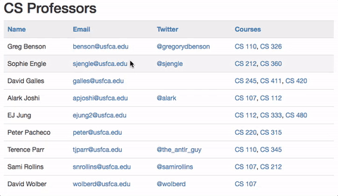

# Jetty and JDBC

These examples show how to connect to a MySQL database from a Jetty server/servlet using JDBC.



## Downloading Connector/J

You need to download a driver to connect Java to our database server. You can download a MySQL Connector/J driver or a MariaDB Connector/J driver. Either way, you can create a third-party library in Eclipse and add the appropriate jar files. The download links are at:

- [MariaDB Connector/J](https://downloads.mariadb.org/connector-java/)
- [MySQL Connector/J](https://dev.mysql.com/downloads/connector/j/)

Name your library `jdbc` to have it automatically included by the lecture examples.

## Configuring JDBC

Modify `database.properties` with your MySQL username and password. If you
are connecting from on-campus, then set `hostname=sql.cs.usfca.edu` in the
properties file.

If you are connecting off-campus, then set `hostname=localhost:3307` in the
properties file, and create an SSH tunnel to forward anything sent to your
port 3307 to our MySQL server on campus using this command:

```
ssh username@stargate.cs.usfca.edu -L 3307:sql.cs.usfca.edu:3306
```

where `username` is your CS username. You will be prompted for your CS password.

If you are a Mac user, you can create a `tunnel.command` file with the SSH command you should use and give the file execute privileges. Then, you should be able to double-click the file to run the command.

If you are a Windows user, you need to setup the tunnel (or port forwarding) using a program like Putty. (Search for "Putty Port Forwarding" to find several guides.)

## Other Resources

- [Java Database Connectivity (JDBC) Slides](https://drive.google.com/file/d/0BxYofk0iB_upNUp2V1BiWGw3NlU/view?usp=sharing)
- [The Java Tutorials – Lesson: JDBC Basics](https://docs.oracle.com/javase/tutorial/jdbc/basics/index.html)
